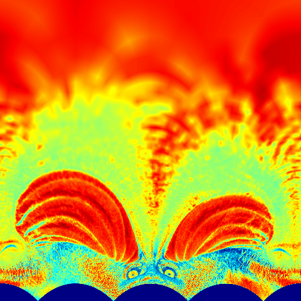

ndarray-log-polar
================
Given a 2D ndarray, convert it from cartesian to log-polar coordinates.

# Example

```javascript
var baboon = require('luminance')(require('baboon-image'))
var ndarray = require('ndarray')
var toPolar = require('ndarray-log-polar')
var imshow = require('ndarray-imshow')

imshow(ndarray(new Float64Array(256*256), [256,256]), baboon, {colormap: 'grey'})
```



# API

#### `require('ndarray-log-polar')(polar, rect[, center])`
Converts an image from Cartesian to polar coordinates.

* `polar` gets the resulting image in polar coordinates
* `rect` is the input cartesian coordinate image
* `center` is an optional center for the cartesian coordinate image

**Returns** An image in polar coordinates

# Credits
(c) 2014 Mikola Lysenko. MIT License